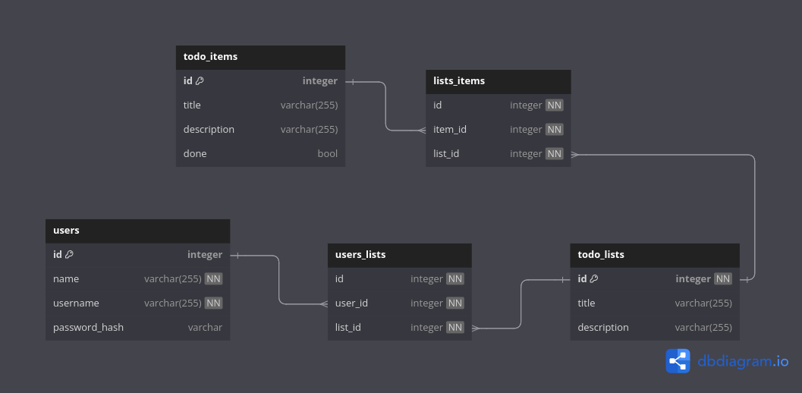

# REST API для списков TO-DO 
    
#### Использованные технологии:
* Разработка, следуя дизайну REST API.
* Gin Web Framework для роутинга.
* Подход Clean Architecture, техника dependency injection.
* Для работы с БД использовалась библиотека sqlx.
* PostgreSQL использовалась для хранения информации.
* Написание SQL запросов.
* Реализованы CRUD операции.
* Создание файлов миграций для поднятия БД с помощью утилиты go-migrate.
* Регистрация и аутентификация.
* Работа с JWT. Middleware для определения пользователя .
* Конфигурация приложения с помощью библиотеки cleanenv.
* Логирование ошибок с помощью библиотеки logrus.
* Makefile для удобного запуска приложения.
* Docker compose файл для объединения приложения с PostgreSQL в один образ.
* Graceful Shutdown для безопасной остановки приложения.

Для тестирования можно использовать Postman.

### Список эндпоинтов:
##### Регистрация и аутентификация:
```
-X POST http://{host}:{port}/auth/sign-up — регистрация
```
```
-X GET http://{host}:{port}/auth/sign-in — аутентификация
```
##### Операции над списками:
```
-X POST http://{host}:{port}/api/lists/ — Создать список
```
```
-X GET http://{host}:{port}/api/lists/ — Получить все списки
```
```
-X GET http://{host}:{port}/api/lists/{id} — Получить список по id
```
```
-X PUT http://{host}:{port}/api/lists/{id} — Обновить список по id
```
```
-X DELETE http://{host}:{port}/api/lists/{id} — Удалить список по id
```
##### Операции над задачами:
```
-X POST http://{host}:{port}/api/lists/{id}/items/ — Создать задачу
```
```
-X GET http://{host}:{port}/api/lists/{id}/items/ — Получить все задачи
```
```
-X GET http://{host}:{port}/api/lists/{id}/items/{item_id} — Получить задачу по id
```
```
-X PUT http://{host}:{port}/api/lists/{id}/items/{item_id} — Обновить здачу по id
```
```
-X DELETE http://{host}:{port}/api/lists/{id}/items/{item_id} — Удалить задачу по id
```

<table>
    <thead>
        <tr>
            <th>Операция над</th>
            <th>Тело запроса</th>
        </tr>
    </thead>
    <tbody>
        <tr>
            <td rowspan=1 align="center">Пользователями</td>
            <td rowspan=1 align="left">{</br>
                                            "name" : " ", </br>
                                            "username" : " ", 
                                            </br>
                                            "password" : " "</br>
                                        }</td>
        </tr>
        <tr>
            <td align="center">Списками</td>
            <td align="left">{</br>
                                "title": " ",</br>
                                "description": " "</br>
                            }</td>
        </tr>
        <tr>
            <td rowspan=1 align="center">Задачами</td>
            <td align="left">{</br>
                                "title": " ",</br>
                                "description": " ",</br>
                                "done": </br>
                            }</td>
        </tr>
    </tbody>
</table>

---
### Схема базы данных
  

---
Для запуска приложения перейдите в дириекторию проекта в терминале и запустите следующие команды:
```
make app-build && make app-run
```

Если запуск производится впервые, то необходимо применить миграции к БД:
```
make migrations_up
```